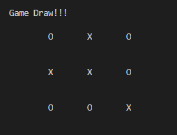

# Tic-Tac-Toe
This most common mini game was my first ever programming project, which I tried to implement with C++ for my Structural Programming Language Lab course on Fall 2016. Later the cpu move was modified with MinMax algorithm. This game is now unbeatable :D.

  

